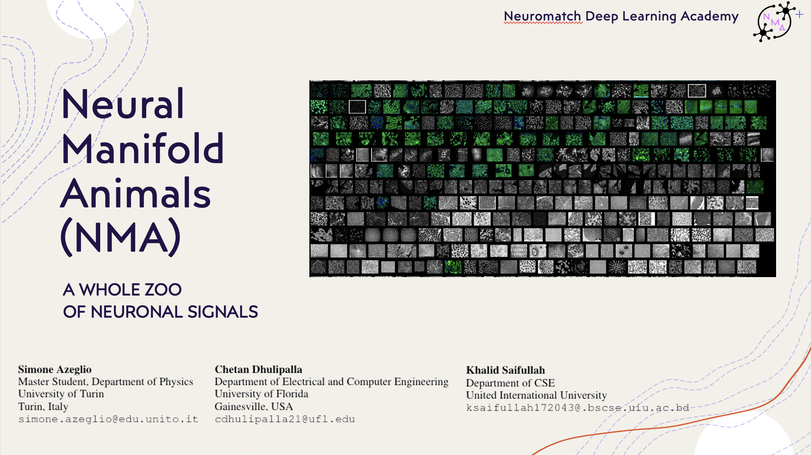

<!-- PROJECT SHIELDS -->
<!--
*** I'm using markdown "reference style" links for readability.
*** Reference links are enclosed in brackets [ ] instead of parentheses ( ).
*** See the bottom of this document for the declaration of the reference variables
*** for contributors-url, forks-url, etc. This is an optional, concise syntax you may use.
*** https://www.markdownguide.org/basic-syntax/#reference-style-links
# NMAs
Neural Manifold Animals - NMA Deep Learning Project 
-->
[![Contributors][contributors-shield]][contributors-url]
[![Forks][forks-shield]][forks-url]
[![Stargazers][stars-shield]][stars-url]
[![Issues][issues-shield]](https://github.com/sazio/NMAs/issues)
[![MIT License][license-shield]](https://github.com/sazio/NMAs/blob/main/License.md)


<!-- PROJECT LOGO -->
<br />
<p align="center">
    <h1 align="center">Neural Manifold Animals (NMAs)</h1>
    <a href="https://github.com/sazio/NMAs">
<p align="center">
    
        
   
  
  <h3 align="center">A Whole Zoo of Neuronal Signals</h3>

  <p align="center">
    project_description
    <br />
    <a href="https://github.com/sazio/NMAs"><strong>Explore the docs »</strong></a>
    <br />
    <br />
    <a href="https://github.com/sazio/NMAs">View Demo</a>
    ·
    <a href="https://github.com/sazio/NMAs">Report Bug</a>
    ·
    <a href="https://github.com/sazio/NMAs">Request Feature</a>
  </p>
</p>


<!-- TABLE OF CONTENTS -->
<details open="open">
  <summary><h2 style="display: inline-block">Table of Contents</h2></summary>
  <ol>
    <li>
      <a href="#about-the-project">About The Project</a>
      <ul>
        <li><a href="#built-with">Built With</a></li>
      </ul>
    </li>
    <li>
      <a href="#getting-started">Getting Started</a>
      <ul>
        <li><a href="#prerequisites">Prerequisites</a></li>
        <li><a href="#installation">Installation</a></li>
      </ul>
    </li>
    <li><a href="#usage">Usage</a></li>
    <li><a href="#roadmap">Roadmap</a></li>
    <li><a href="#contributing">Contributing</a></li>
    <li><a href="#license">License</a></li>
    <li><a href="#contact">Contact</a></li>
    <li><a href="#acknowledgements">Acknowledgements</a></li>
  </ol>
</details>


<!-- ABOUT THE PROJECT -->
## About The Project (Neuromatch Academy Deep Learning Project) 
### Abstract
 
The brain can be modelled as a high-dimensional dynamical system. Despite its high dimensionality, many components of the brain during specific functions can be understood through some lower-dimensional representation. We call this representation ”the hidden dynamics” that underlie the activity of the brain’s neurons.These hidden dynamics provide a good description of whatever function the brain is performing. Here, we firstly attempt to understand whether dynamics can be extracted as a low dimensional embedding of neural population (corresponding roughly to different layers in V1 ). On the other hand, we try to determine how many latent dimensions are needed to cluster - or classify - different neural populations activities. We hypothesized that, given the noisy activity of many neurons, the relevant dynamics may be seen as a nonlinear combination of a small fraction of the total neurons in each physiological layer. Using the Stringer dataset [1][2], we trained an LSTM [3] (i.e. RNN ) to encode a layer of neurons. This encoding was accomplished by training the neuron to reconstruct the input at the output while passing the input through a low-dimensional hidden layer to force the network to compress the input data. Assuming that the network is able to get a good reconstruction, this hidden layer contains the compression of the neurons into a lower-dimensional space. During the preliminary phase of our work, by running several hyperparameter optimization sweeps, we discovered that the optimal dimension - in a reconstruction task - for the latent space is rather limited,- 75 dims out of 1131 neurons per layer - i.e. 7% of the original signals dimension. This is an encouraging result, which apparently testify our starting hypothesis. Now, given that the reconstruction error is minimized, we can shift our attention on the latent dynamics representation for each anatomical layer. Possible future directions will explore the existence of multi-scale temporal dynamics and how to efficiently extract them. From this perspective, either more advanced RNN’s regularization techniques or the use of architectures, e.g. LFADS [4] more grounded on dynamical systems aspects.

 
[1] Stringer,  Carsen,  et  al.   “Spontaneous  behaviors  drive  multidimensional,  brainwide  activity.”  Science 364.6437 (2019).

[2] Stringer, Carsen, et al.  “High-precision coding in visual cortex.” Cell 184.10 (2021): 2767-2778.

[3] Hocreiter, Sepp, et al. ”Long Short-Term Memory”, Neural Computation Volume 9 Issue 8 (1997)

[4] Pandarinath,  Chethan,  et  al.   ”Inferring  single-trial  neural  population  dynamics  using  sequential  auto-encoders” Nature Methods 15, 805–815 (2018)

### Built With

* [PyTorch](https://pytorch.org/)
* [wandb](https://wandb.ai/)


<!-- GETTING STARTED -->
## Getting Started

To get a local copy up and running follow these simple steps.

### Prerequisites

ToDo - List of libraries

### Installation

1. Clone the repo
   ```sh
   git clone https://github.com/sazio/NMAs.git
   ```

<!-- USAGE EXAMPLES -->
## Usage

ToDo - Tutorial 


<!-- ROADMAP -->
## Roadmap

See the [open issues](https://github.com/sazio/NMAs/issues) for a list of proposed features (and known issues).


<!-- CONTRIBUTING -->
## Contributing

Contributions are what make the open source community such an amazing place to be learn, inspire, and create. Any contributions you make are **greatly appreciated**.

1. Fork the Project
2. Create your Feature Branch (`git checkout -b feature/AmazingFeature`)
3. Commit your Changes (`git commit -m 'Add some AmazingFeature'`)
4. Push to the Branch (`git push origin feature/AmazingFeature`)
5. Open a Pull Request

## Materials

### Articles


### Useful Implementations

### Other


<!-- LICENSE -->
## License

MIT License

Copyright (c) 2021 Simone Azeglio, Chetan Dhulipalla , Khalid Saifullah

Permission is hereby granted, free of charge, to any person obtaining a copy of this software and associated documentation files (the "Software"), to deal in the Software without restriction, including without limitation the rights to use, copy, modify, merge, publish, distribute, sublicense, and/or sell copies of the Software, and to permit persons to whom the Software is furnished to do so, subject to the following conditions:

The above copyright notice and this permission notice shall be included in all copies or substantial portions of the Software.

THE SOFTWARE IS PROVIDED "AS IS", WITHOUT WARRANTY OF ANY KIND, EXPRESS OR IMPLIED, INCLUDING BUT NOT LIMITED TO THE WARRANTIES OF MERCHANTABILITY, FITNESS FOR A PARTICULAR PURPOSE AND NONINFRINGEMENT. IN NO EVENT SHALL THE AUTHORS OR COPYRIGHT HOLDERS BE LIABLE FOR ANY CLAIM, DAMAGES OR OTHER LIABILITY, WHETHER IN AN ACTION OF CONTRACT, TORT OR OTHERWISE, ARISING FROM, OUT OF OR IN CONNECTION WITH THE SOFTWARE OR THE USE OR OTHER DEALINGS IN THE SOFTWARE.


<!-- CONTACT -->
## Contact

Simone Azeglio - email : [simone.azeglio@edu.unito.it](simone.azeglio@edu.unito.it) - [linkedin](https://www.linkedin.com/in/simoneazeglio/) - [twitter](https://twitter.com/simoneazeglio)

Chetan Dhulipalla - email : []() - [linkedin]() - [twitter]()

Khalid Saifullah - email : []() - [linkedin]() - [twitter]()


Project Link: [https://github.com/sazio/NMAs](https://github.com/sazio/NMAs)


<!-- ACKNOWLEDGEMENTS -->
## Acknowledgements


* [Neuromatch Academy](https://academy.neuromatch.io/)


<!-- MARKDOWN LINKS & IMAGES -->
<!-- https://www.markdownguide.org/basic-syntax/#reference-style-links -->
[contributors-shield]: https://img.shields.io/github/contributors/sazio/NMAs.svg?style=for-the-badge
[contributors-url]: https://github.com/sazio/NMAs/graphs/contributors
[forks-shield]: https://img.shields.io/github/forks/sazio/NMAs.svg?style=for-the-badge
[forks-url]: https://github.com/sazio/NMAs/network/members
[stars-shield]: https://img.shields.io/github/stars/sazio/NMAs.svg?style=for-the-badge
[stars-url]: https://github.com/sazio/NMAs/stargazers
[issues-shield]: https://img.shields.io/github/issues/sazio/NMAs.svg?style=for-the-badge
[issues-url]: https://github.com/sazio/NMAs/issues
[license-shield]: https://img.shields.io/github/license/sazio/NMAs.svg?style=for-the-badge
[license-url]: https://github.com/sazio/NMAs/blob/main/LICENSE.md


